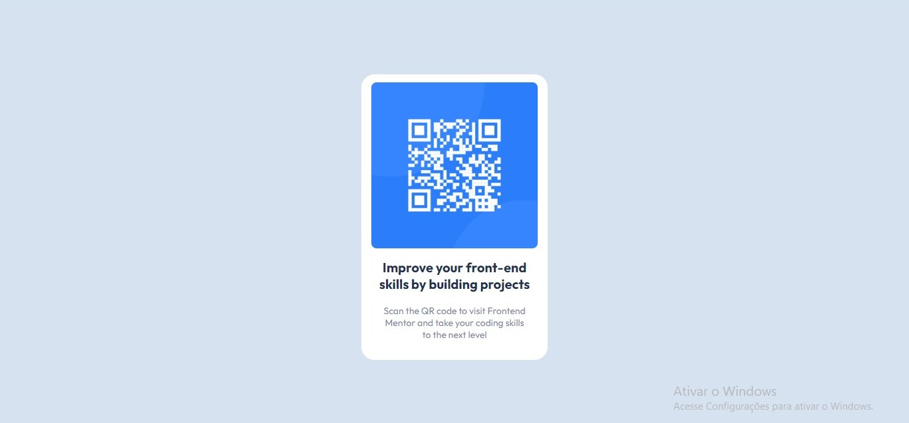
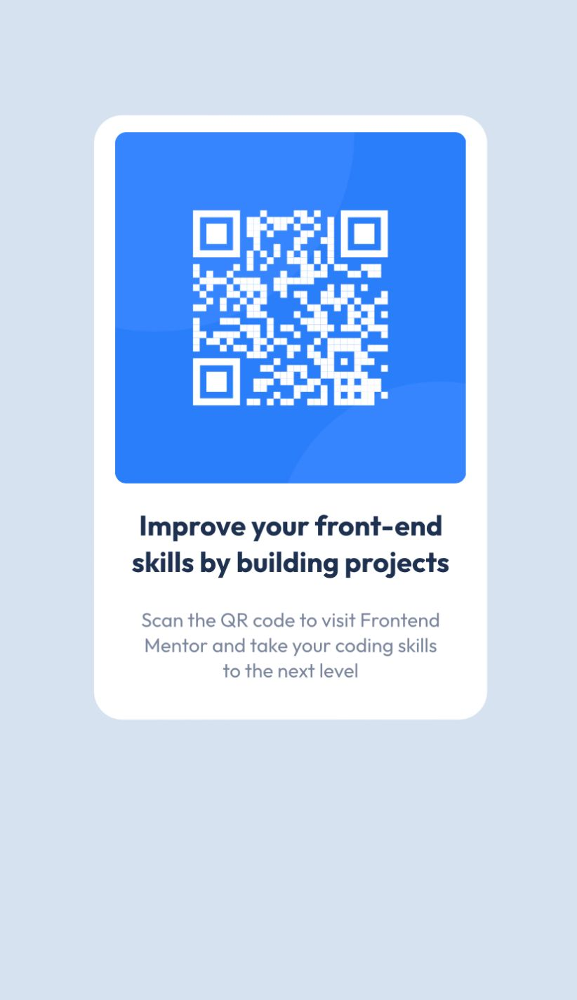

### Frontend Mentor - solução de componente de código QR 

Esta é uma solução para o desafio do componente de código QR no Frontend Mentor de codificação criando projetos realistas.

## Índice

- [Visão geral](#visão-geral)
  - [O desafio](#o-desafio)
  - [Captura de tela](#captura-de-tela)
  - [Links](#links)
- [Meu processo](#meu-processo)
  - [Construído com](#construído-com)
  - [O que eu aprendi](#o-que-eu-aprendi)
- [Autor](#autor)
- [Agradecimentos](#agradecimentos)

 ### Visão geral

O desafio

Um primeiro desafio perfeito se você for novo em HTML e CSS. O layout do cartão não muda, por isso é ideal se você ainda não aprendeu a criar layouts responsivos.

### Captura de tela

Desktop

Mobile

### Links

- URL da solução: https://github.com/rug19/qrcode
- URL do site ao vivo: https://rug19.github.io/qrcode/

## Meu processo

 Construído com

- Marcação HTML5 
- Propriedades personalizadas CSS

### O que eu aprendi

Aprendi como centralizar o componente facilmente para um melhor layout utilizando o Grid.

body {
min-height: 100vh;
display: grid;
place-items: center;
}

## Autor

- Site - [Ruan Gomes](https://rug19.github.io/qrcode/)
- Frontend Mentor - [@rug19](https://www.frontendmentor.io/profile/rug19)

## Agradecimentos

Agredeço a comunidade front-end mentor que analisou o meu codigo e me ajudou a consertar alguns erros de codificação. 

